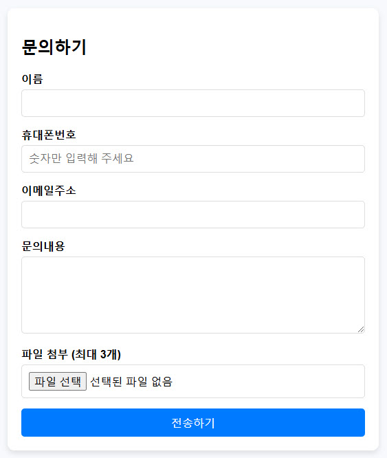

# 폼메일 프로그램

이 프로젝트는 간단한 폼메일 프로그램입니다.  
사용자로부터 이름, 휴대폰번호, 이메일 주소, 문의 내용을 입력받고 최대 3개의 파일을 첨부하여 전송할 수 있습니다.  
전송된 문의 내용은 관리자가 지정한 이메일로 전달됩니다.  

  
  
기능
- 사용자 입력값 유효성 검사
- 이메일 형식 검증
- 최대 3개의 파일 첨부 가능 (각 파일 최대 5MB)
- 실패 시 이전 화면으로 돌아가기 기능
- 성공 시 전송 완료 메시지와 함께 메인 화면으로 리다이렉트
  
  
설치 및 사용 방법
  
1. 프로젝트 클론  
git clone https://github.com/nicecoding1/php_formmail.git
  
2. 파일 구성  
   - form.php: 사용자 입력 폼을 포함한 파일
   - form_send.php: 입력된 폼 데이터를 처리하여 이메일로 전송하는 파일
   - form_send_smtp.php: 입력된 폼 데이터를 처리하여 이메일(SMTP 방식)로 전송하는 파일
  
3. form.php 파일 내용  
form.php 파일은 사용자 입력을 위한 HTML 폼으로 구성되어 있습니다.  
이 파일에서는 JavaScript를 통해 입력값을 체크하며, 다음과 같은 필드가 포함됩니다.
   - 이름
   - 휴대폰번호
   - 이메일주소
   - 문의내용
   - 파일첨부 (최대 3개)
  
4. form_send.php 파일 내용  
form_send.php 파일에서는 폼 데이터를 받아 이메일로 전송합니다.  
전송 성공 여부에 따라 다음과 같이 처리됩니다.
   - 성공 시: form.php로 리다이렉트합니다.
   - 실패 시: 경고창을 띄운 후 이전 화면으로 돌아갑니다.

5. form_send_smtp.php 파일 내용  
form_send_smtp.php 파일에서는 폼 데이터를 받아 이메일로 전송합니다.  
SMTP 방식으로 이메일을 발송할 때 기존의 form_send.php 파일을 삭제하고 이 파일의 이름을 form_send.php 으로 변경해서 사용합니다.  
전송 성공 여부에 따라 다음과 같이 처리됩니다.
   - 성공 시: form.php로 리다이렉트합니다.
   - 실패 시: 경고창을 띄운 후 이전 화면으로 돌아갑니다.
  
6. 이메일 전송 설정  
이 프로그램을 정상적으로 작동시키기 위해서는 서버에서 PHP의 mail() 함수를 사용할 수 있어야 합니다.  
또는 SMTP를 사용하는 경우, form_send_smtp.php 파일을 사용할 수 있습니다.
   
   form_send.php 예시  
   $to = "admin@example.com"; // 이메일 수신자 주소  
   $subject = "새로운 문의가 도착했습니다"  
   // 이메일 전송 설정과 내용은 form_send.php에서 설정합니다.  
  
7. 사용 방법  
   1. form.php를 웹 브라우저로 열어 문의 내용을 입력합니다.
   2. 모든 필드를 입력하고 "전송하기" 버튼을 클릭하면 form_send.php로 데이터가 전송됩니다.
   3. 성공 시 메인 화면으로 리다이렉트되며, 실패 시 경고 메시지와 함께 이전 화면으로 돌아갑니다.

8. 유의사항  
   - form_send.php의 이메일 수신자 주소를 설정해야 합니다.
   - 서버에서 메일 전송 기능이 활성화되어 있어야 정상적으로 전송됩니다.

